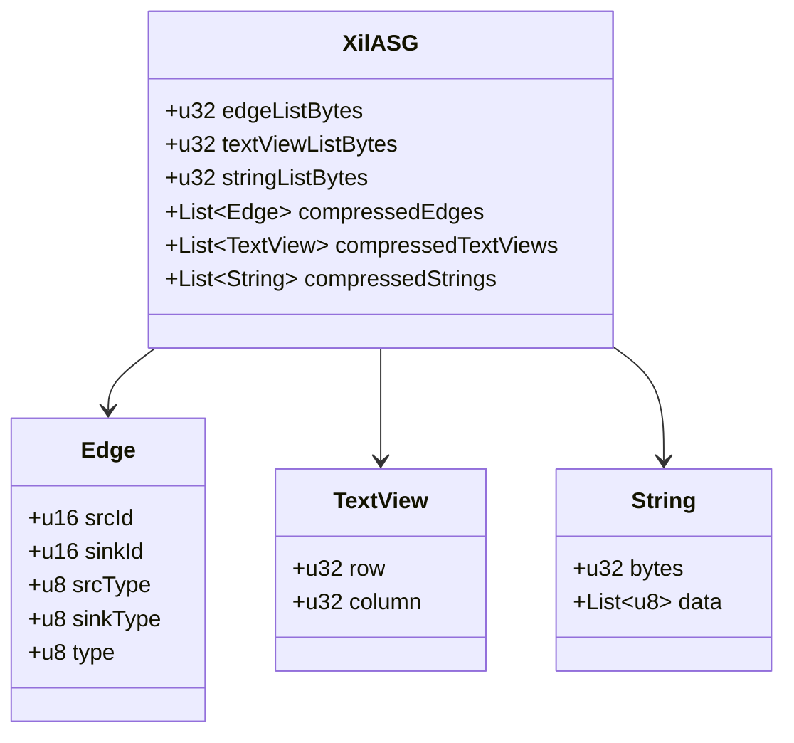

# xil

xil is a cross platform intermediate language which looks like assembler with boiled down instruction set.
It is designed to be a target for various compilers and tools by providing a very easy text and binary format.
The text format use the ini file structure with sections and key-value pairs.
The binary format stores the abstract syntax graph (asg) in a very compact format together with the string and text view lists.

## Text format

```ini
[module app]
# module with name "app"
[use builtin]
# use the module named "builtin"
[lib "KERNEL32.DLL"]
# Load the shared library "KERNEL32.DLL" by an PE import table.
exit="ExitProcess"
# Map the library symbol "ExitProcess" to an symbol "exit".
[ffi]
# Map library symbols as functions using the C calling convention.
exit=(code:i32)void
# Symbol "exit" takes a 32-Bit integer and doesn't return anything.
[fun.main]
# A function block named "main".
call=exit,0
# Execute the "exit" function with the numeric literal "0".
```

## Binary format


