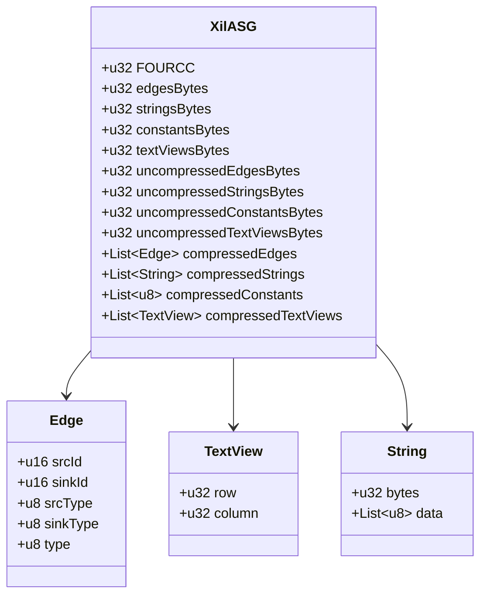

# xil

xil is a cross-platform intermediate language which looks like assembly with a boiled down instruction set.
It is designed to be a target for various compilers and tools by providing a very easy text and binary format.
The text format uses the ini file structure with sections and key-value pairs.
The binary format stores the abstract syntax graph (ASG) in a very compact format together with the string and textview lists.

## Text format

```ini
[module app]
# module with name "app"
[use builtin]
# use the module named "builtin"
[lib "KERNEL32.DLL"]
# Load the shared library "KERNEL32.DLL" by an PE import table.
exit="ExitProcess"
# Map the library symbol "ExitProcess" to an symbol "exit".
[ffi]
# Map library symbols as functions using the C calling convention.
exit=(code:i32)void
# Symbol "exit" takes a 32-Bit integer and doesn't return anything.
[fun main]
# A function block named "main".
call=exit,0
# Execute the "exit" function with the numeric literal "0".
```

## Binary format



## Workflow

The lexer will process the text and generate edges depending on the context.

A TextView is used to reference the edge to the source text. It can be used to print detailed errors, support refactoring and can be stripped away if it is no longer needed.

Each literal is stored in the string list and identifiers are represented by node IDs.

The constant section contains all processed literals, including strings. At this point it works as a memory block which is used by the edges.

## Edges and Nodes

xil uses an abstract syntax graph (ASG) instead of an abstract syntax tree. An ASG can be stored as an edge list very efficiently and utilizes graph algorithms and columnar searches.

Searching for a function can be implemented highly efficiently with multithreading and SIMD by searching the srcID and sinkID columns.

Columns can be compressed better due to higher repetition of values.

Data deduplication is easily achieved by using edges with the same sink.

The edge list can be placed in SQLite and utilize SQL queries for efficient data retrieval and manipulation.

The ASG can be sorted in the way you need to work on nodes. For example, textview edges can be sorted to the end of the edge list and skipped during processing. Sorting by srcID and sinkID represents the order of struct fields and function arguments because of increasing node IDs.

## Language

The assembler like language can be parsed without recursion and nested loops.

It can be parsed by a single variable containing the current block and the key-value.

```ini
[module app]
# current block = module
# Each key-value would be interpreted with module as context.  
[fun main]
# current block = fun
args=argn:i32, argv:ptr
# args is a reserved keyword for a function context.
```

### Blocks

* module
* use
* lib
* ffi
* fun
* struct

The syntax is designed in reverse by writing a lexer and parser with SIMD and adjusting it step by step to achive higher processing throughput. The C++ test code utilized SSE2 and SSE4.2 (https://www.felixcloutier.com/x86/pcmpistrm) in combination with needle optimization it achieves nearly memory bandwidth speed in the lexer phase. Using multithreading in any way makes no sence and slows down the lexer. Assign one file per worker returns the best results even on a 200MB large test file.
Instead of interpreting each byte it interprets 32 bytes and categorize them as letters, digits, hexes, TERMINALS and so on and returns a equially large bytestream with bitsets. The next stage can create an edge list with node types representing tokens.

The parser can work on the graph without backtracking and remove or replace edges.

Compared to assembler xil uses variables and strong-types to reduce the amount of instructions. Instead of cmp, many jump instructions and special register it use a high level approach of cmp and if with a hidden compare state. A compiler or VM can use the type and parameter
information to build the right machine code.

```ini
[module app]
[fun main]
args=argn:i32, argv:ptr
cmp=argn, 1
# compare argn(i32) and 1(i32)
# if argn < 1 then set -1
# if argn == 1 then set 0
# if argn > 1 then set 1
if=1,no_args
# continue if argn is 2 or more else jump to no_args
call=exit,0
label=no_args
# set a jump point named no_args
call=exit,1
```
